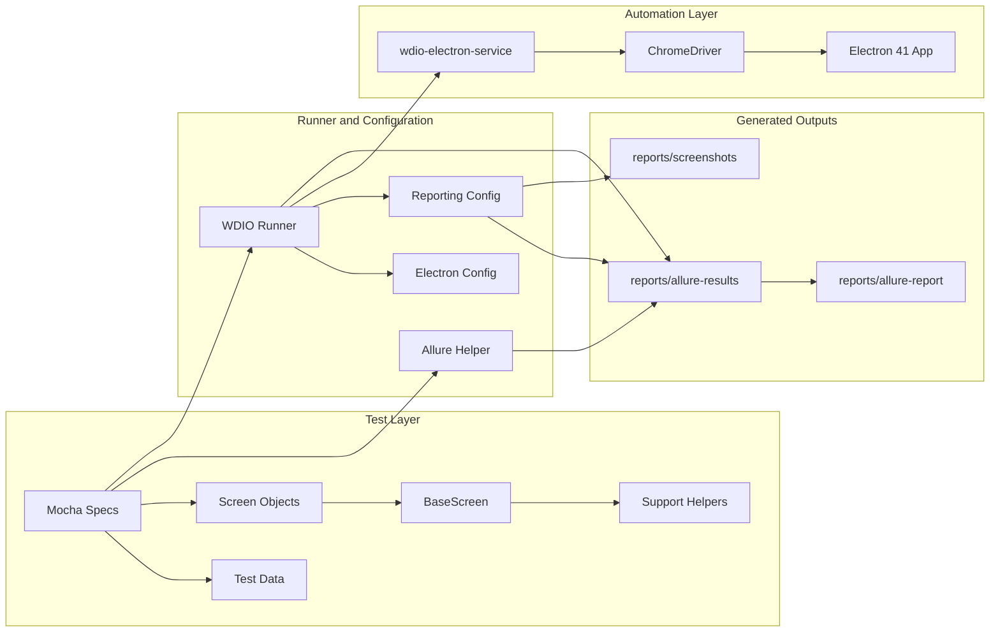
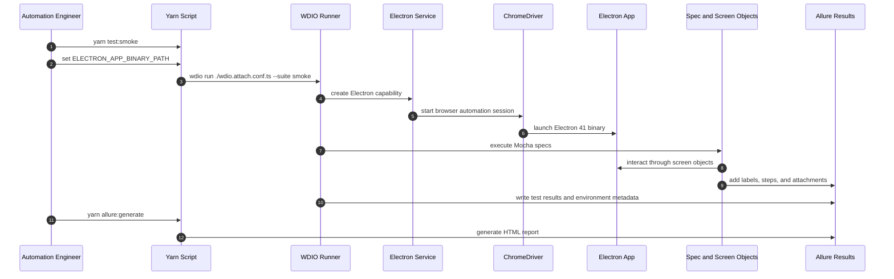
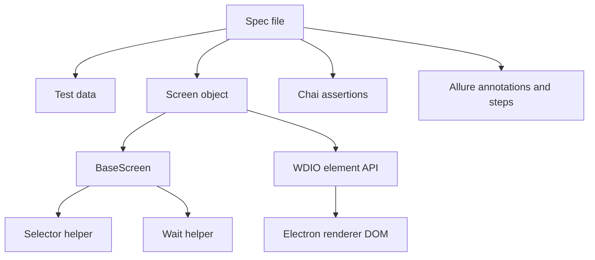
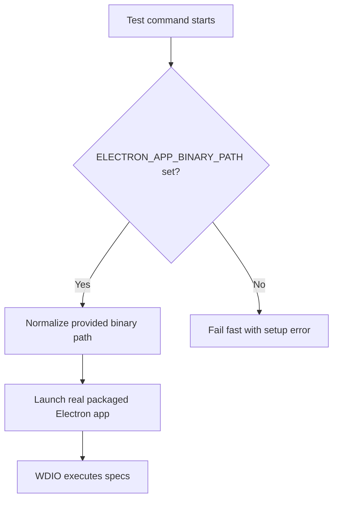
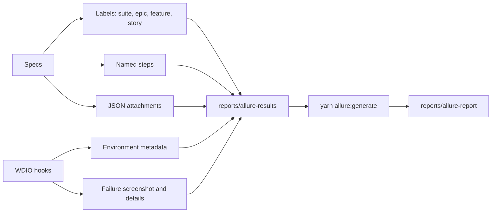
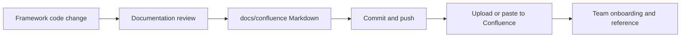

# Architecture and Flow Diagrams

This page contains Mermaid diagrams for Confluence. If Mermaid rendering is not available, export the diagrams as images and attach them to the page.

## Framework Architecture

## Test Execution Sequence

## Page Object Model Flow

## Packaged App Resolution

## Allure Reporting Flow

## Documentation Ownership

