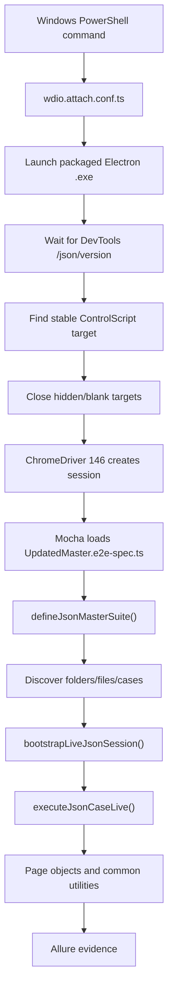
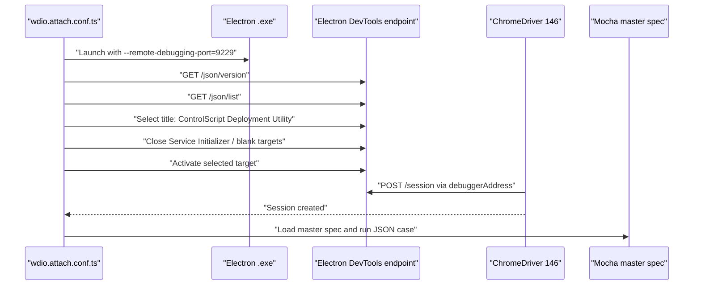

# WDIO Electron Master Spec Refactor Design

| Field                  | Value                                                               |
| ---------------------- | ------------------------------------------------------------------- |
| Author                 | Oybek                                                               |
| Audience               | QA Team and Engineering                                             |
| Repository             | `bek4466/WDIO-electron-framework`                                   |
| Branch                 | `feature-e2e`                                                       |
| Application Under Test | Packaged Electron 41 `.exe`                                         |
| Automation Stack       | TypeScript, Node.js, WebdriverIO 9, Mocha, Allure, ChromeDriver 146 |

## Executive Summary

The legacy E2E assets from `bek4466/e2e-wdio-refactor` branch `old-code-e2e` were brought into the new WDIO Electron framework and refactored into a data-driven, page-object-based architecture.

The new framework keeps the JSON test case catalog as the source of truth, while moving execution logic into typed TypeScript support modules. This makes the master specs easier to maintain, easier to filter, and safer to run against a packaged Electron app on Windows.

Recent work also resolved a major Windows runtime blocker: ChromeDriver was attaching to hidden or blank Electron targets instead of the real `ControlScript Deployment Utility` window. The framework now waits for the correct DevTools target, activates it, closes known hidden/blank targets, and then starts WDIO session creation.

## Goals

- Preserve legacy JSON test coverage from the old repo.
- Keep master spec files thin and readable.
- Support page object model, reusable utilities, and data-driven execution.
- Run against a real packaged Electron 41 `.exe` on Windows.
- Generate Allure evidence with steps, metadata, screenshots, videos, logs, and JSON attachments.
- Allow focused execution by master suite, folder, JSON file, and JSON case id.
- Keep CI/CD out of scope for now.

## Non-Goals

- CI/CD pipeline design.
- Rewriting every old page object from scratch.
- Replacing lab/device dependencies that exist outside the Electron UI.
- Committing Allure reports, screenshots, videos, or runtime logs.

## Source Refactor

Legacy source:

```text
bek4466/e2e-wdio-refactor
branch: old-code-e2e
path: e2e/src
path: e2e/tests
```

New framework location:

```text
WDIO-electron-framework
branch: feature-e2e
path: e2e/src
path: e2e/tests
```

Important old files reviewed during refactor:

| Old File                                                       | New Handling                                                                      |
| -------------------------------------------------------------- | --------------------------------------------------------------------------------- |
| `e2e/tests/regression/NEWMASTERSPEC/UpdatedMaster.e2e-spec.ts` | Replaced with a thin entrypoint that calls `defineJsonMasterSuite(...)`.          |
| `e2e/tests/commonMethods.po.ts`                                | Behavior mapped into common utilities and live JSON executor branches.            |
| `e2e/src/deployment/destinyInputField.po.ts`                   | File upload behavior preserved through live UI actions and project-file handling. |
| JSON manifests under `datajson/files.json`                     | Still used for discovery and execution order.                                     |
| Legacy page objects under `e2e/src`                            | Kept available and reused where practical.                                        |

## Current Architecture



## Key Framework Files

| File                                                           | Purpose                                                                                                          |
| -------------------------------------------------------------- | ---------------------------------------------------------------------------------------------------------------- |
| `wdio.conf.ts`                                                 | Main WDIO config using `wdio-electron-service`.                                                                  |
| `wdio.attach.conf.ts`                                          | Manual attach config for packaged Windows `.exe`; preferred for current Electron attach debugging and execution. |
| `config/electron.config.ts`                                    | Electron binary path, ChromeDriver path, Electron 41 capability, and packaged app config helpers.                |
| `e2e/tests/regression/NEWMASTERSPEC/UpdatedMaster.e2e-spec.ts` | Thin master-spec entrypoint for the new JSON runner.                                                             |
| `e2e/tests/support/json-master-runner.ts`                      | Discovers executable JSON cases and registers Mocha tests.                                                       |
| `e2e/tests/support/json-live-executor.ts`                      | Maps legacy JSON step/action vocabulary into live WDIO UI execution.                                             |
| `src/support/evidence.ts`                                      | Screenshots, video, logs, and Allure evidence handling.                                                          |
| `scripts/probe-chromedriver-attach.mjs`                        | Standalone ChromeDriver attach diagnostic.                                                                       |
| `scripts/inspect-electron-targets.mjs`                         | DevTools target inspection for packaged Electron app.                                                            |

## Electron Attach Design

The packaged Electron app exposes multiple DevTools targets. During debugging, ChromeDriver saw:

- A real app target: `ControlScript Deployment Utility`
- A hidden target: `Service Initializer Process!`
- A blank target with empty `title` and empty `url`

ChromeDriver was initially attaching to the wrong target before Mocha started, so no JSON test executed. The manual attach config now performs pre-session target management.

Target attach flow:



Important environment variables:

| Variable                                     | Purpose                                                                          |
| -------------------------------------------- | -------------------------------------------------------------------------------- |
| `CSDU_EXE_LOCATION`                          | Preferred path to packaged CSDU `.exe`.                                          |
| `ELECTRON_APP_BINARY_PATH`                   | Generic Electron `.exe` path fallback.                                           |
| `CHROMEDRIVER_BINARY_PATH`                   | Explicit path to ChromeDriver 146.                                               |
| `ELECTRON_ATTACH_DEBUG_PORT`                 | DevTools port. Default is `9229`.                                                |
| `ELECTRON_ATTACH_TARGET_TITLE`               | Target window title. Recommended: `ControlScript Deployment Utility`.            |
| `ELECTRON_ATTACH_CLOSE_EMPTY_TARGETS`        | Closes blank title/blank URL targets before session creation. Default is `true`. |
| `ELECTRON_ATTACH_CLOSE_TARGET_TITLE_PATTERN` | Optional close filter, for example `Service Initializer`.                        |
| `ELECTRON_CHROME_WINDOW_TYPES`               | Target types allowed for ChromeDriver, for example `tab,page,app,webview`.       |

## JSON Master Spec Discovery

The new master runner discovers cases from each folder's `datajson/files.json` manifest.

Discovery rules:

1. Resolve folders from `E2E_JSON_FOLDERS` or master-spec defaults.
2. Read each folder's `datajson/files.json`.
3. Optionally filter JSON files using `E2E_JSON_FILES`.
4. Read each JSON file.
5. Select executable cases from root `Execute` array or case-level `Execute=true`.
6. Optionally filter case ids using `E2E_JSON_CASES`.
7. Register one Mocha test per selected JSON case.

Generated test title format:

```text
[Deployment-tests/CSP-326.e2e-spec.json] TestCase1 - Verify that Build and Upload is not successful after user provides invalid username/password
```

## New Way To Run Master Spec Tests

### Run New Master In Live Mode

```powershell
$env:CSDU_EXE_LOCATION="C:\path\to\ControlScript Deployment Utility.exe"
$env:CHROMEDRIVER_BINARY_PATH="C:\path\to\chromedriver-146.exe"
$env:ELECTRON_ATTACH_TARGET_TITLE="ControlScript Deployment Utility"
$env:ELECTRON_ATTACH_CLOSE_EMPTY_TARGETS="true"

$env:E2E_JSON_EXECUTION_MODE="live"

yarn test:e2e-json:newmaster
```

### Run One Folder

```powershell
$env:E2E_JSON_EXECUTION_MODE="live"
$env:E2E_JSON_FOLDERS="Deployment-tests"

yarn test:e2e-json:newmaster
```

### Run One JSON File

```powershell
$env:E2E_JSON_EXECUTION_MODE="live"
$env:E2E_JSON_FOLDERS="Deployment-tests"
$env:E2E_JSON_FILES="CSP-326.e2e-spec.json"

yarn test:e2e-json:newmaster
```

### Run One Case Inside One JSON File

```powershell
$env:E2E_JSON_EXECUTION_MODE="live"
$env:E2E_JSON_FOLDERS="Deployment-tests"
$env:E2E_JSON_FILES="CSP-326.e2e-spec.json"
$env:E2E_JSON_CASES="TestCase1"

yarn test:e2e-json:newmaster
```

### Run Multiple Files Or Cases

Comma-separated values are supported:

```powershell
$env:E2E_JSON_FILES="CSP-326.e2e-spec.json,CSP-327.e2e-spec.json"
$env:E2E_JSON_CASES="TestCase1,TestCase2"
```

## Recommended Windows Debug Command

Use this command shape while stabilizing packaged `.exe` execution:

```powershell
git checkout feature-e2e
git pull origin feature-e2e

$env:CSDU_EXE_LOCATION="C:\path\to\ControlScript Deployment Utility.exe"
$env:CHROMEDRIVER_BINARY_PATH="C:\path\to\chromedriver-146.exe"
$env:ELECTRON_ATTACH_DEBUG_PORT="9229"
$env:ELECTRON_CHROME_WINDOW_TYPES="tab,page,app,webview"
$env:ELECTRON_ATTACH_TARGET_TITLE="ControlScript Deployment Utility"
$env:ELECTRON_ATTACH_CLOSE_EMPTY_TARGETS="true"
$env:ELECTRON_ATTACH_TARGET_STABLE_MS="5000"
$env:ELECTRON_ATTACH_TARGET_TIMEOUT_MS="300000"
$env:WDIO_CONNECTION_RETRY_TIMEOUT_MS="600000"

$env:E2E_JSON_EXECUTION_MODE="live"
$env:E2E_JSON_FOLDERS="Deployment-tests"
$env:E2E_JSON_FILES="CSP-326.e2e-spec.json"
$env:E2E_JSON_CASES="TestCase1"

yarn test:e2e-json:newmaster
```

## Allure And Evidence

The framework attaches evidence at several layers:

| Evidence                    | Purpose                                                          |
| --------------------------- | ---------------------------------------------------------------- |
| Allure labels               | Suite, epic, feature, story, owner, severity, and tags.          |
| Allure links                | User story, task, and test case links parsed from JSON metadata. |
| JSON test case attachment   | Sanitized full JSON case for traceability.                       |
| Action summary attachment   | Source folder, source file, project file, and step keys.         |
| Screenshots                 | Captured around test failures and evidence hooks.                |
| Videos                      | Captured when enabled by the evidence helper.                    |
| WDIO logs                   | Attached from `reports/wdio-logs`.                               |
| ChromeDriver logs           | Attached from `reports/wdio-logs/chromedriver-session.log`.      |
| Electron target diagnostics | Target selection/action JSON files under `reports/wdio-logs`.    |

Runtime artifacts are intentionally ignored by Git and should not be committed:

```text
reports/allure-results
reports/allure-report
reports/screenshots
reports/videos
reports/wdio-logs
```

## Refactor Decisions

| Decision                                                | Reason                                                                                           |
| ------------------------------------------------------- | ------------------------------------------------------------------------------------------------ |
| Keep master specs thin                                  | Reduces risk and makes JSON discovery reusable.                                                  |
| Keep JSON as source of truth                            | Preserves legacy test investment.                                                                |
| Move live action mapping into `json-live-executor.ts`   | Centralizes old action vocabulary and makes missing mappings visible.                            |
| Use `wdio.attach.conf.ts` for packaged `.exe` debugging | Gives control over Electron launch, DevTools readiness, target cleanup, and ChromeDriver attach. |
| Add file/case filters before Mocha registration         | Prevents accidental execution of the wrong JSON case.                                            |
| Attach unsupported/device actions to Allure             | Keeps evidence visible for lab-dependent flows while preserving test stability decisions.        |

## Known Constraints

- Windows packaged `.exe` runtime is required for true live validation.
- Electron 41 requires ChromeDriver 146 compatibility.
- The npm `chromedriver` package in the repo may not match Electron 41; use `CHROMEDRIVER_BINARY_PATH` when needed.
- Device/network actions still depend on the correct lab environment.
- Some legacy helper behavior is represented as structured Allure evidence if it cannot safely run outside the target environment.

## Troubleshooting

### App Launches But Tests Do Not Start

Check lifecycle:

```powershell
Get-Content reports\wdio-logs\wdio-attach-lifecycle.log -Tail 120
```

Expected sequence:

```text
spawning Electron app
Electron DevTools endpoint is ready
stable Electron DevTools target is ready
prepared Electron attach target
beforeSession
before framework hook
beforeTest
```

If execution stops before `before framework hook`, the issue is still session creation, not the master spec.

### ChromeDriver Attaches To Wrong Target

Check target actions:

```powershell
Get-Content reports\wdio-logs\electron-attach-target-actions.json -Tail 160
```

Confirm:

- `selectedTarget.title` is `ControlScript Deployment Utility`
- blank targets are closed when `ELECTRON_ATTACH_CLOSE_EMPTY_TARGETS=true`
- Service Initializer target is closed when `ELECTRON_ATTACH_CLOSE_TARGET_TITLE_PATTERN="Service Initializer"` is set

### Wrong JSON Test Runs

Use runner-level filters instead of Mocha grep:

```powershell
$env:E2E_JSON_FOLDERS="Deployment-tests"
$env:E2E_JSON_FILES="CSP-326.e2e-spec.json"
$env:E2E_JSON_CASES="TestCase1"
```

## Ownership And Handoff

QA owns test data, JSON manifests, test case selection, and expected result updates.

Engineering owns product-level selectors, Electron app startup behavior, and any changes that impact DevTools target exposure.

Automation owns framework configuration, live action mappings, Allure evidence, and runner diagnostics.

Recommended collaboration loop:

1. QA identifies the JSON file/case to run.
2. Automation verifies the runner selection and live mapping.
3. Engineering helps when the app exposes hidden/blank targets, selector changes, or renderer startup changes.
4. QA reviews Allure evidence and validates expected behavior.
