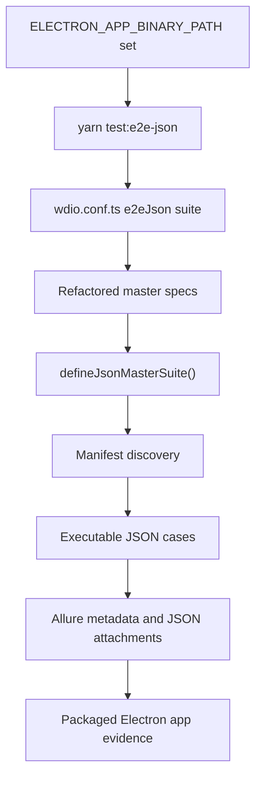

# JSON Refactor Changes

## Summary

This branch extends the framework with legacy E2E catalog support under `e2e/`, which discovers and validates imported JSON test cases from master manifests.

Earlier temporary local validation assets have been removed. The framework now expects a real packaged Electron binary through `ELECTRON_APP_BINARY_PATH`.

## Execution Flow



## JSON Test Shape

Each JSON test has:

| Field      | Purpose                                                                     |
| ---------- | --------------------------------------------------------------------------- |
| `id`       | Stable test identifier used in the WDIO title and Allure tags.              |
| `title`    | Human-readable behavior name.                                               |
| `metadata` | Allure suite, epic, feature, story, severity, owner, tags, and description. |
| `data`     | Scenario input and expected values.                                         |
| `steps`    | Ordered action list executed by the spec's typed handler map.               |

Example step:

```json
{
  "name": "Validate ready status through shared assertion utility",
  "action": "expectStatusContains",
  "expected": "Ready for automation"
}
```

## Why This Pattern

- JSON remains the source of test flow and expected data.
- Specs stay thin and only bind allowed JSON actions to framework code.
- Page object model remains responsible for selectors and UI interactions.
- Shared utilities remain reusable across JSON and regular TypeScript specs.
- Allure receives useful labels, step names, and the full JSON test case attachment.

## Adding The Next JSON Flow

1. Add a JSON file under `src/test-data/json`.
2. Create or reuse a screen object under `src/screens`.
3. Add a focused spec under `src/specs/smoke` or `src/specs/regression`.
4. Define a typed action union and handler map.
5. Run `yarn typecheck`, `yarn format:check`, and the relevant WDIO suite.

For imported legacy cases, continue using `yarn test:e2e-json` and the catalog runner documented in `docs/e2e-json-data-driven.md`.
