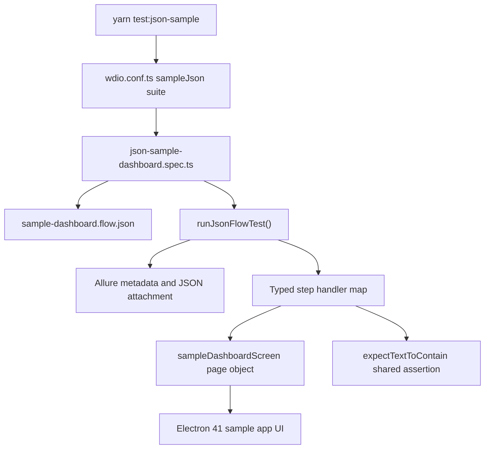

# JSON Refactor Changes

## Summary

This branch extends the framework with two JSON-driven layers:

- Legacy E2E catalog support under `e2e/`, which discovers and validates imported JSON test cases from master manifests.
- A runnable sample JSON smoke flow under `src/`, which executes JSON-defined steps against the Electron 41 sample app through the framework page object model.

The first layer protects the imported historical test assets. The second layer is the recommended pattern for adding new maintainable JSON-driven automation.

## New Runnable JSON Sample

The sample flow lives in:

```text
src/test-data/json/sample-dashboard.flow.json
```

The spec that consumes it lives in:

```text
src/specs/smoke/json-sample-dashboard.spec.ts
```

Run only this sample:

```bash
yarn test:json-sample
```

The command launches the packaged Electron 41 sample app, reads the JSON flow, maps each JSON action to a typed handler, and validates the UI through `sampleDashboardScreen`.

## Execution Flow



## JSON Test Shape

Each JSON test has:

| Field      | Purpose                                                                     |
| ---------- | --------------------------------------------------------------------------- |
| `id`       | Stable test identifier used in the WDIO title and Allure tags.              |
| `title`    | Human-readable behavior name.                                               |
| `metadata` | Allure suite, epic, feature, story, severity, owner, tags, and description. |
| `data`     | Scenario input and expected values.                                         |
| `steps`    | Ordered action list executed by the spec's typed handler map.               |

Example step:

```json
{
  "name": "Validate ready status through shared assertion utility",
  "action": "expectStatusContains",
  "expected": "Ready for automation"
}
```

## Why This Pattern

- JSON remains the source of test flow and expected data.
- Specs stay thin and only bind allowed JSON actions to framework code.
- Page object model remains responsible for selectors and UI interactions.
- Shared utilities remain reusable across JSON and regular TypeScript specs.
- Allure receives useful labels, step names, and the full JSON test case attachment.

## Adding The Next JSON Flow

1. Add a JSON file under `src/test-data/json`.
2. Create or reuse a screen object under `src/screens`.
3. Add a focused spec under `src/specs/smoke` or `src/specs/regression`.
4. Define a typed action union and handler map.
5. Run `yarn typecheck`, `yarn format:check`, and the relevant WDIO suite.

For large imported legacy cases, continue using `yarn test:e2e-json` and the catalog runner documented in `docs/e2e-json-data-driven.md`.
